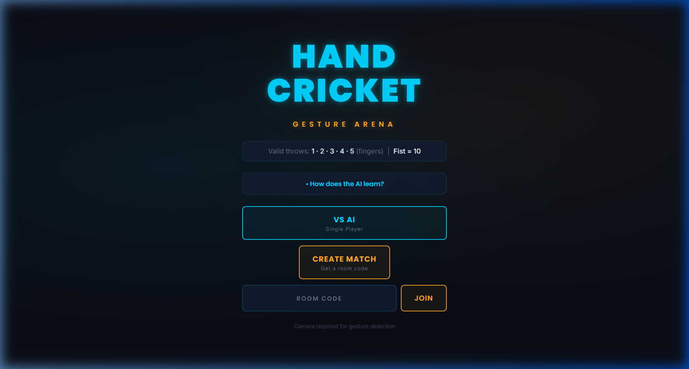
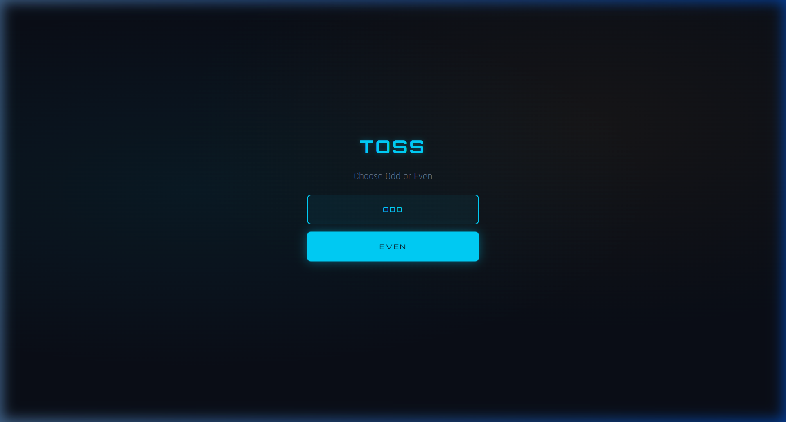

# Hand Cricket (Odd-Even) Gesture Arena 🏏🤖

An awesome, AI-powered web-based Hand Cricket game. Experience the classic childhood game in a futuristic Neon/Dark-mode UI directly in your browser!



## ✨ Features

- **Gesture Recognition:** Play using your webcam! Powered by MediaPipe Hand Tracking, the game accurately detects 1-5 fingers and a fist (for 10).
- **Adaptive AI Engine:** The single-player AI learns your patterns in real-time combining 3 prediction models:
  - *Markov Chains (50%)*: Tracks transition throws (e.g., throwing a 3 after a 5).
  - *Frequency Analysis (30%)*: Counts your most used numbers.
  - *Recency Bias (20%)*: Adapts to your last 8 throws.
- **Online Multiplayer:** Spin up a private match with a room code! The Node.js WebSocket server perfectly synchronizes the gameplay, toss, and scoring with your friends.
- **Modern UI:** Built from scratch using modern typography (Poppins/Inter) with a gorgeous dark navy, teal, and gold aesthetic. 



## 🚀 How to Deploy on Render (Free & Fast)

Since the online multiplayer utilizes WebSockets via a Node.js server, **Render** is the easiest way to host this for free.

1. Create a free account on [Render.com](https://render.com/).
2. Click the **New +** button and select **Web Service**.
3. Choose **Build and deploy from a Git repository** and link this GitHub repository.
4. Use the following configuration:
   - **Environment:** `Node`
   - **Build Command:** `npm install`
   - **Start Command:** `npm start` (or `node server.js`)
5. Click **Create Web Service**. 
6. Once deployed (typically takes 2 mins), Render will give you a live URL (e.g., `hand-cricket-arena.onrender.com`). Send the URL to your friends, create a match, share the room code, and play!

## 💻 Running Locally

To run the game on your own machine:

1. Clone the repository
   ```bash
   git clone https://github.com/AnshadityaSharma/odd_eve.git
   cd odd_eve
   ```
2. Install dependencies (for the WebSockets):
   ```bash
   npm install
   ```
3. Start the local server:
   ```bash
   node server.js
   ```
4. Open your browser and navigate to `http://localhost:3000`.

## 🛠️ Tech Stack
- **Frontend:** HTML5, CSS3, Vanilla JavaScript
- **Computer Vision:** MediaPipe Hands API
- **Backend (Multiplayer):** Node.js, `ws` (WebSockets)
